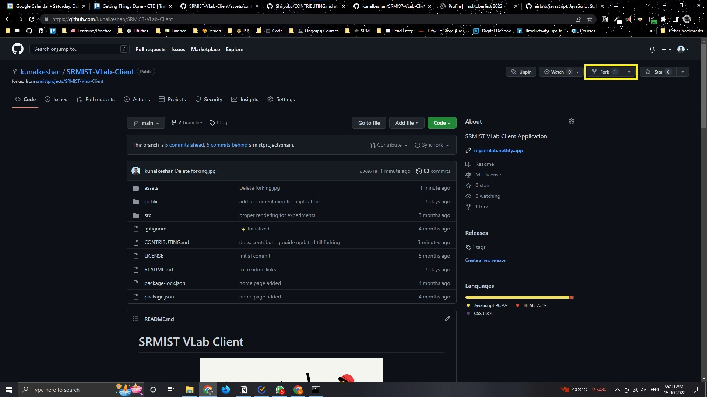

# Contributing Guide

**Table of Contents**:

- [Getting Started](#-getting-started)
  - [Prerequisites](#prerequisites)
  - [Staring the Service Application (Quick Setup)](#starting-service-application)
  - [Starting the Client Application](#starting-the-client-application)
- [How to Contribute](#-how-to-contribute)
- [Standards and Guidelines](#-standards-and-guidelines)
- [Basic Contributing Guidelines](#-basic-contributing-guidelines)
- [Advanced Contributing Guidelines](#-advanced-contributing-guidelines)
- [Creating a Pull Request](#-creating-a-pull-request)
- [Merging a Pull Request](#-merging-a-pull-request)
- [Questions](#-questions)

## 🚀 Getting Started

When contributing to VLab **Client**, it's good to know our best practices, tips, and tricks. VLab Client is built using React-JavaScript. Uses Material UI components and fetches the resources from the [service application](https://github.com/kunalkeshan/SRMIST-VLab-Service).

### Prerequisites

It's recommended that you have a basic knowledge of how to work with the MERN stack, before actually contributing to it. Of course, if you're not familiar with the stack, you can always open an [issue](https://github.com/kunalkeshan/SRMIST-VLab-Client/issues/new) to express your opinions.

**Software requirements**:

- Latest version of Git - [https://git-scm.com/downloads](https://git-scm.com/downloads)*
- LTS Release of Node.js - [https://nodejs.org/en/download/](https://nodejs.org/en/download/)*
- MongoDB - [https://www.mongodb.com/docs/manual/installation/](https://www.mongodb.com/docs/manual/installation/) (optional) or
- MongoDB Atlas - [https://www.mongodb.com/atlas/database](https://www.mongodb.com/atlas/database)*

### Starting Service Application

If you're contributing to the pages related to the subjects and experiments, you'll need to have the [service application](https://github.com/kunalkeshan/SRMIST-VLab-Service) cloned and have some dummy data to test as well.

Steps to follow to quickly clone and get started with the **Service Application**:

**Fork and Clone the Service Repo**:

```bash
git clone https://github.com/<your-github-username>/SRMIST-VLab-Service
```

**Install All Dependencies**:

```bash
npm install
```

**Add Required Envs**:

Since you'll be working in development, create a `.env.development` in the root of your service application and add the following contents to the file.

```env
NODE_ENV="<node environment>"
DB_URL="<mongodb url here>"
CLIENT_URL="<client url here>"
SERVER_URL="<server url here>"
```

**Add Dummy data to Your Database**:

In your MongoDB, there should be two collections, `experiments` and `subjects`, download the dummy data below and import them into the respective collections. Make sure to download the latest version and use them.

- [Experiments](./assets/contributing/mongo/)
- [Subjects](./assets/contributing/mongo)

**Start Your Application**:

```bash
npm run start:dev
```

The **service application** should run on `http://localhost:5000`.

### Starting the Client Application

**Fork and Clone the Client Repo**:

```bash
git clone https://github.com/<your-github-username>/SRMIST-VLab-Client
```

**Install All Dependencies**:

```bash
npm install --legacy-peer-deps
```

**Start Your Application**:

```bash
npm run start
```

## ❓ How to Contribute?

There's two separate guidelines for how to contribute to the VLab Client. If you're simply looking to make some files changes to any one of the following files...

- `README.md`
- `CONTRIBUTING.md`
- Or any documentation related file.

Refer to the [Basic Contributing Guidelines](#-basic-contributing-guidelines). This will go over how to easily make changes without having to push any files locally.

If you're looking for making changes to the website and resources to this project, please refer to the [Advanced Contributing Guidelines](#-advanced-contributing-guidelines).

## 📐 Standards and Guidelines

### Common Guidelines

- Follow AirBnb JavaScript syntax when implementing your changes. For more information, refer [https://github.com/airbnb/javascript](https://github.com/airbnb/javascript) 

## 🗡️ Forking the Project

First you will have to obtain your own copy of the VLab Client repository, also known as "forking". [Click here](https://github.com/kunalkeshan/SRMIST-VLab-Client/fork) to open the fork wizard or go to the top right of your screen and then click the fork button.



## 🐰 Basic Contributing Guidelines

## 🤖 Advanced Contributing Guidelines

## 👾 Creating a Pull Request

## 🐙 Merging a Pull Request

## ❓ Questions

For any queries about this project, or there's some issue that you're unable to resolve, feel free to reach out to [Kunal Keshan](mailto:kunalkeshan12@gmail.com).
